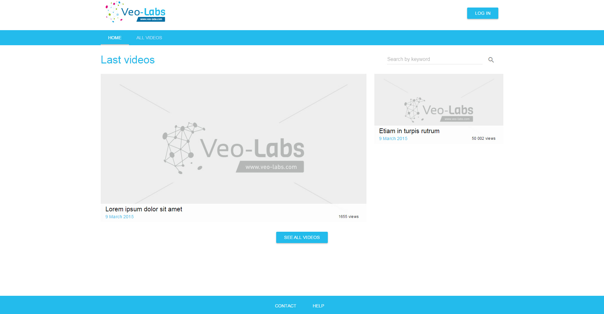
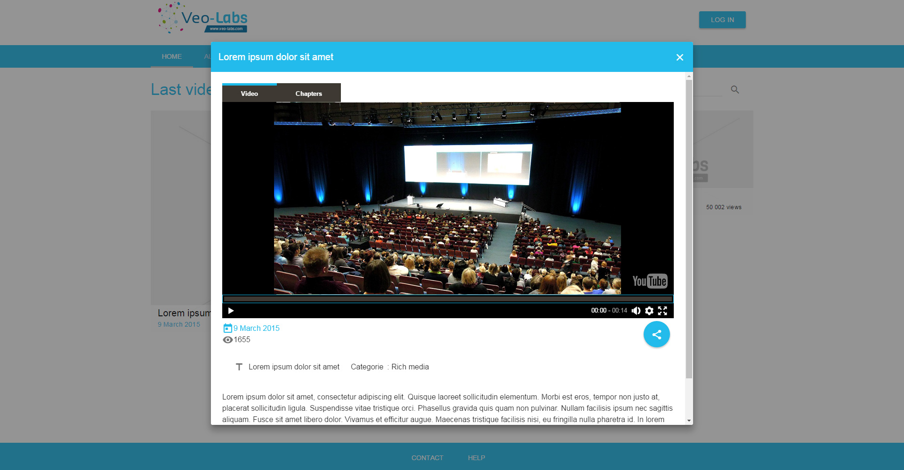
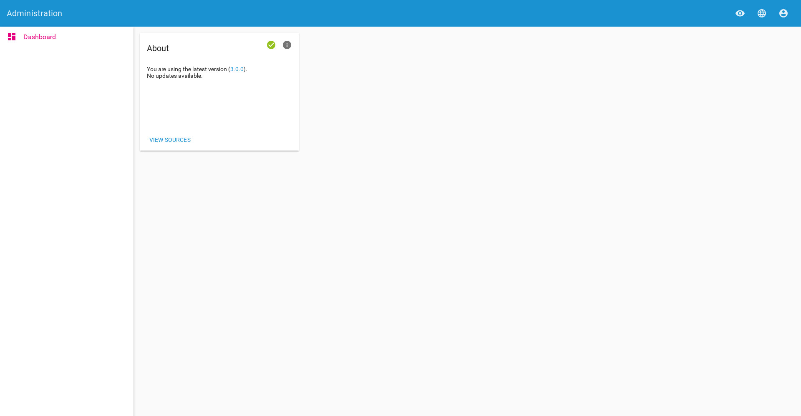

# What's OpenVeo Portal?

OpenVeo Portal is a Node.js / AngularJS application. It embeds an HTTP applicative server based on [Express framework](http://expressjs.com/).

It aims to offer a portal to access medias exposed by an [OpenVeo](https://github.com/veo-labs/openveo-core) server associated to an [OpenVeo Publish](https://github.com/veo-labs/openveo-publish) plugin.

It includes the following features:

- An home page to present the most seen medias
- A search engine
- Support for authentication using local database, [CAS](https://www.apereo.org/projects/cas) or [LDAP](https://en.wikipedia.org/wiki/Lightweight_Directory_Access_Protocol)
- Themes
- Statistics with support for [Piwik](http://piwik.org/)
- An administration interface

## Authentication

OpenVeo Portal supports the following SSO (Single Sign On) providers:

- [LDAP](https://en.wikipedia.org/wiki/Lightweight_Directory_Access_Protocol)
- [CAS](https://www.apereo.org/projects/cas)

## Compatibility

OpenVeo Portal has been tested on the following operating systems:

- Windows 10
- Ubuntu 16.04

OpenVeo has been tested on the following:

- Google Chrome 54
- Mozilla Firefox 47
- Opera 42
- Internet Explorer Edge

## Screenshots

### Home page

### Video player

### Back office dashboard
